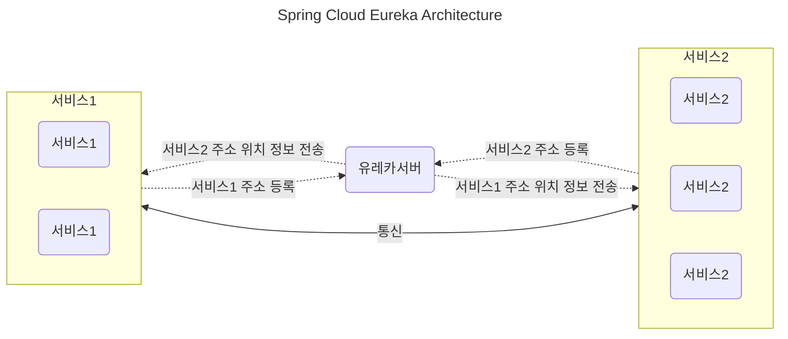
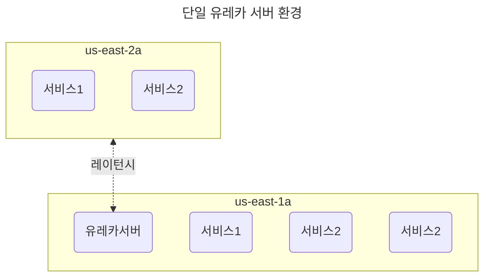
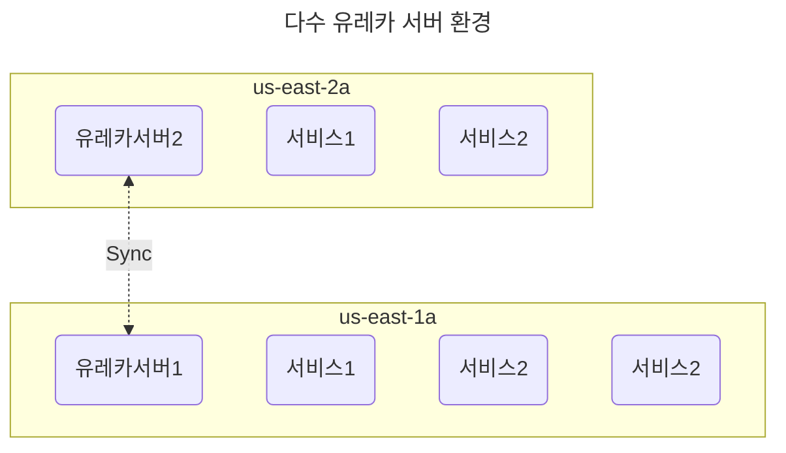
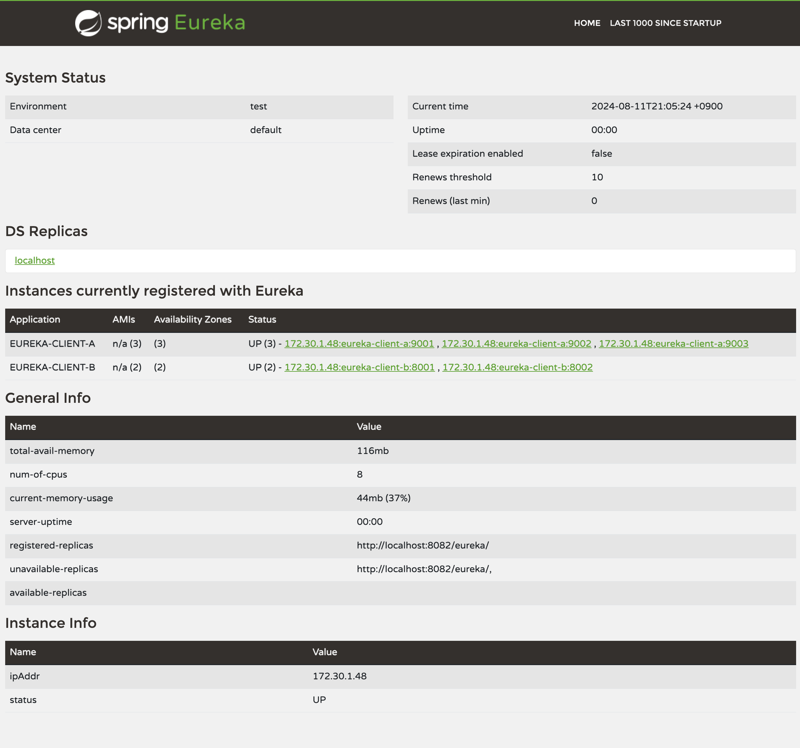
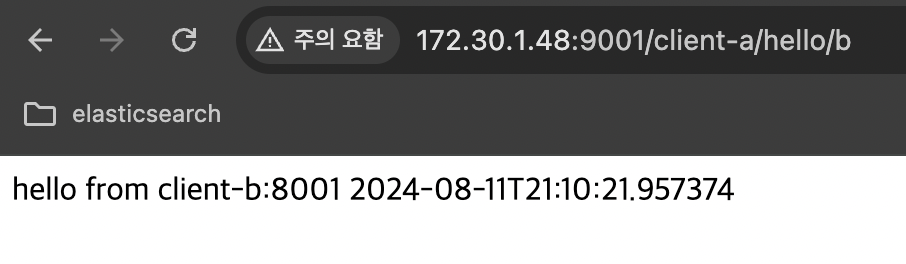
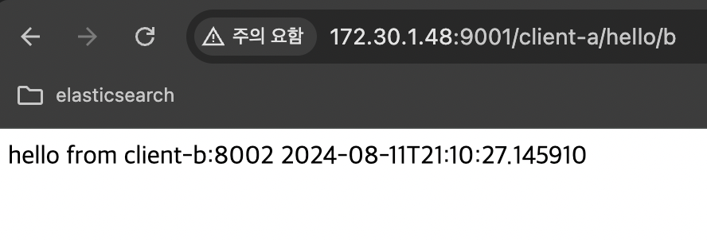
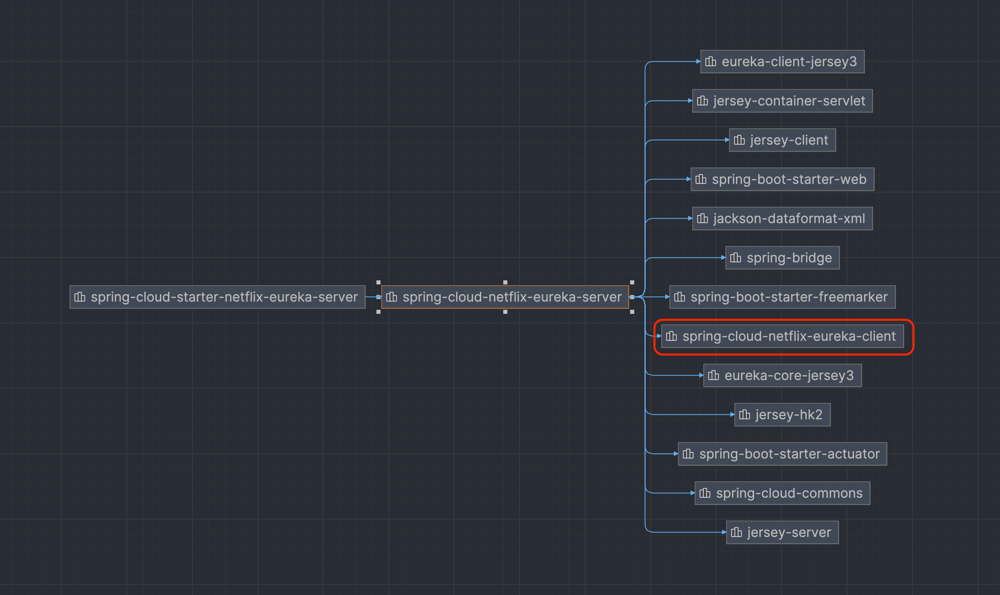

# Spring Cloud Netflix - Eureka

[1. 개요](#1-개요)  
[2. Spring Cloud Netflix - Eureka Server](#2-spring-cloud-netflix---eureka-server)  
[3. 프로젝트 구동하여 확인하기](#3-프로젝트-구동하여-확인하기)  
[4. 설정 관련 요약](#4-설정-관련-요약)  


### 1. 개요
- MSA 환경에서 동적으로 변하는 상황에서의 서비스 위치를 관리하고자 하는 니즈가 있다.
  - 오토스케일, 컨테이너 환경 등
- 이를 위해 서비스 레지스트리와 디스커버리 패턴이 등장한다.  

|패턴명| 설명                                                                                                                                                                                                                               |
|--|----------------------------------------------------------------------------------------------------------------------------------------------------------------------------------------------------------------------------------|
|서비스 레지스트리 패턴| 마이크로서비스의 관리를 위해 유동적인 서비스의 IP, PORT를 매핑하여 저장하는 패턴                                                                                                                                                                                 |
|서비스 디스커버리 패턴| 서비스 클라이언트가 서비스를 호출할 때 각 서비스의 위치를 알아낼 수 있도록 하는 패턴 <br><br> Client Side Discovery <br> 서비스 클라이언트가 레지스트리에서 직접 찾아 호출하는 방식 <br><br> Server Side Discovery <br> 서비스 클라이언트가 proxy로 호출하면 LB가 레지스트리에서 위치를 찾아 리턴, 라우팅하는 방식 <br> AWS의 ELB 등 |

### 2. Spring Cloud Netflix - Eureka Server
[Spring Cloud Netflix](https://cloud.spring.io/spring-cloud-netflix/reference/html/)
- 서비스가 Eureka 서버에 자신을 등록하고, 다른 서비스는 이 서버를 통해 각 서비스 인스턴스의 위치를 검색할 수 있게 해준다.
- Netflix는 왜 이런 라이브러리를 만들게 되었을까..?
  - 글로벌 스트리밍 서비스에서 각 마이크로서비스들이 문제 없이 통신하기 위해 고안된게 아닐까

**아키텍처**  
크게 Eureka Server, Eureka Client로 구성된다.  

|구성 요소| 설명                                                                                                                                                                                                 |
|--|----------------------------------------------------------------------------------------------------------------------------------------------------------------------------------------------------|
|Eureka Server| 1. REST API 기반으로 Eureka Client 정보를 관리한다. <br> 2. Eureka Client들에게 자신이 가지고 있는 정보를 공유한다. <br> 특히 Spring Cloud Gateway, Ribbon 등에서 이를 사용한다. <br> 3. 레지스트리의 모든 정보는 Eureka Client에 복제되며 30초마다 목록을 갱신한다. |
|Eureka Client| 1. 서비스 Start Up 시점에 Eureka Server에 자신의 정보를 등록한다. <br> 2. 등록 후 30초마다 헬스체크를 전송하여 자신의 가용상태를 랄린다. <br> 3. Eureka Server로부터 다른 Eureka Client의 서비스 정보를 확인할 수 있다.                                         |

  


#  <p>
규모가 좀 더 커지면 디스커버리 서버도 레플리카를 고려할 수 있다.     
&rarr; 클라우드 환경에서 서로 다른 Zone에 있는 서비스들이 디스커버리 서버를 한군데만 사용하면 레이턴시가 발생


#  <p>
각 존 별로 디스커버리 서버를 두어 레플리카를 활용하는 방법으로도 구상할 수 있다.

- k8s 환경에서는 DNS 플러그인과 etcd를 활용하여 서비스 레지스트리를 수행한다.
  - **같은 클러스터 내의 서비스**는 별도의 레지스트리 없이 찾아갈 수 있다.

## <p>
### 3. 프로젝트 구동하여 확인하기
1. 각 어플리케이션 bootJar 빌드
    ```bash
    ./gradle-build.sh
    ```
2. 포트를 다르게 설정하여 3대의 유레카 클라이언트와 / 2대의 서비스 레지스트리 서버를 구동
    ```bash
    # 각기 다른 터미널에서 foreground로 실행
    
    # 1번 서비스 레지스트리 서버 구동 - localhost:8081
    ./run-server-a.sh
    
    # 2번 서비스 레지스트리 서버 구동 - localhost:8082
    ./run-server-b.sh
    
    # 1번 유레카 클라이언트 b 구동 - localhost:8001
    ./run-client-b-1.sh
    
    # 2번 유레카 클라이언트 b 구동 - localhost:8002
    ./run-client-b-2.sh
    
    # 1번 유레카 클라이언트 a 구동 - localhost:9001
    ./run-client-a-1.sh
    
    # 2번 유레카 클라이언트 a 구동 - localhost:9002
    ./run-client-a-2.sh
    
    # 3번 유레카 클라이언트 a 구동 - localhost:9003
    ./run-client-a-3.sh
    ```
3. 유레카 대시보드 확인
    
4. client-a 서비스에 접근하여 client-b의 결과를 반환하는 요청을 반복하여 서비스 b가 라우팅되는지 확인한다.  
   다음과 같이 feign client의 명칭을 서비스 레지스트리에 등록된 서비스명으로만 설정한다.
    ```kotlin
    import org.springframework.cloud.openfeign.FeignClient
    import org.springframework.web.bind.annotation.GetMapping
    
    @FeignClient(name="eureka-client-b")
    interface ClientBClient {
        @GetMapping("/client-b/hello")
        fun getHello(): String
    }
    ```
    
      
   
    ```mermaid
    ---
    title: 구동 결과 아키텍처
    ---
    flowchart TD
        EUREKA_SERVER_A("eureka-server-a:8081")
        EUREKA_SERVER_B("eureka-server-b:8082")
        subgraph EUREKA_SERVER["서비스 레지스트리"]
            direction LR
            EUREKA_SERVER_A
            EUREKA_SERVER_B
        end
        subgraph EUREKA_CLIENT_A[eureka-client-a]
            direction LR
            EUREKA_CLIENT_A1("eureka-client-a:9001")
            EUREKA_CLIENT_A2("eureka-client-a:9002")
            EUREKA_CLIENT_A3("eureka-client-a:9003")
        end
        subgraph EUREKA_CLIENT_B[eureka-client-b]
            direction LR
            EUREKA_CLIENT_B1("eureka-client-b:8001")
            EUREKA_CLIENT_B2("eureka-client-b:8002")
        end
        
        EUREKA_CLIENT_A -.-> |client-a 주소 등록| EUREKA_SERVER
        EUREKA_CLIENT_B -.-> |client-b 주소 등록| EUREKA_SERVER
        EUREKA_CLIENT_A <--> |통신| EUREKA_CLIENT_B
        EUREKA_SERVER_A <-.-> |정보 동기화| EUREKA_SERVER_B
        EUREKA_SERVER -.-> |client-b 주소 위치 정보 전송| EUREKA_CLIENT_A
        EUREKA_SERVER -.-> |client-a 주소 위치 정보 전송| EUREKA_CLIENT_B
    ```  

# <p>
### 4. 설정 관련 요약

**Eureka Server**  
다음 라이브러리를 추가하여 프로젝트를 생성한다.
```
implementation("org.springframework.cloud:spring-cloud-starter-netflix-eureka-server")
```

### <p>
다음과 같이 @EnableEurekaServer 어노테이션을 추가하고 서버를 구동해본다.
```kotlin
import org.springframework.boot.autoconfigure.SpringBootApplication
import org.springframework.boot.runApplication
import org.springframework.cloud.netflix.eureka.server.EnableEurekaServer

@SpringBootApplication
@EnableEurekaServer
class ServerApplication

fun main(args: Array<String>) {
    runApplication<ServerApplication>(*args)
}
```
<details>
<summary>Trouble Shooting</summary>

다음 에러가 발생하지만, 서버는 정상적으로 구동되어 localhost:8080에 접근하면 대시보드를 확인할 수 있다.
```
2024-08-11T12:46:31.302+09:00  INFO 45417 --- [server] [           main] c.n.d.s.t.d.RedirectingEurekaHttpClient  : Request execution error. endpoint=DefaultEndpoint{ serviceUrl='http://localhost:8761/eureka/}, exception=java.net.ConnectException: Connection refused stacktrace=jakarta.ws.rs.ProcessingException: java.net.ConnectException: Connection refused
	at org.glassfish.jersey.client.internal.HttpUrlConnector.apply(HttpUrlConnector.java:275)
	at org.glassfish.jersey.client.ClientRuntime.invoke(ClientRuntime.java:300)
	...

2024-08-11T12:46:31.302+09:00  WARN 45417 --- [server] [           main] c.n.d.s.t.d.RetryableEurekaHttpClient    : Request execution failed with message: java.net.ConnectException: Connection refused
2024-08-11T12:46:31.302+09:00  INFO 45417 --- [server] [           main] com.netflix.discovery.DiscoveryClient    : DiscoveryClient_SERVER/172.30.1.48:server - was unable to refresh its cache! This periodic background refresh will be retried in 30 seconds. status = Cannot execute request on any known server stacktrace = com.netflix.discovery.shared.transport.TransportException: Cannot execute request on any known server
	at com.netflix.discovery.shared.transport.decorator.RetryableEurekaHttpClient.execute(RetryableEurekaHttpClient.java:112)
	at com.netflix.discovery.shared.transport.decorator.EurekaHttpClientDecorator.getApplications(EurekaHttpClientDecorator.java:134)
	...

2024-08-11T12:46:31.443+09:00  INFO 45417 --- [server] [       Thread-9] o.s.c.n.e.server.EurekaServerBootstrap   : Initialized server context
2024-08-11T12:46:31.445+09:00  INFO 45417 --- [server] [           main] o.s.b.w.embedded.tomcat.TomcatWebServer  : Tomcat started on port 8080 (http) with context path '/'
2024-08-11T12:46:31.445+09:00  INFO 45417 --- [server] [           main] .s.c.n.e.s.EurekaAutoServiceRegistration : Updating port to 8080
2024-08-11T12:46:31.448+09:00  INFO 45417 --- [server] [foReplicator-%d] c.n.d.s.t.d.RedirectingEurekaHttpClient  : Request execution error. endpoint=DefaultEndpoint{ serviceUrl='http://localhost:8761/eureka/}, exception=java.net.ConnectException: Connection refused stacktrace=jakarta.ws.rs.ProcessingException: java.net.ConnectException: Connection refused
	at org.glassfish.jersey.client.internal.HttpUrlConnector.apply(HttpUrlConnector.java:275)
	at org.glassfish.jersey.client.ClientRuntime.invoke(ClientRuntime.java:300)
	...

2024-08-11T12:46:31.448+09:00  WARN 45417 --- [server] [foReplicator-%d] c.n.d.s.t.d.RetryableEurekaHttpClient    : Request execution failed with message: java.net.ConnectException: Connection refused
2024-08-11T12:46:31.448+09:00  WARN 45417 --- [server] [foReplicator-%d] com.netflix.discovery.DiscoveryClient    : DiscoveryClient_SERVER/172.30.1.48:server - registration failed Cannot execute request on any known server

com.netflix.discovery.shared.transport.TransportException: Cannot execute request on any known server
	at com.netflix.discovery.shared.transport.decorator.RetryableEurekaHttpClient.execute(RetryableEurekaHttpClient.java:112) ~[eureka-client-2.0.3.jar:2.0.3]
	at com.netflix.discovery.shared.transport.decorator.EurekaHttpClientDecorator.register(EurekaHttpClientDecorator.java:56) ~[eureka-client-2.0.3.jar:2.0.3]
	...

2024-08-11T12:46:31.450+09:00  WARN 45417 --- [server] [foReplicator-%d] c.n.discovery.InstanceInfoReplicator     : There was a problem with the instance info replicator

com.netflix.discovery.shared.transport.TransportException: Cannot execute request on any known server
	at com.netflix.discovery.shared.transport.decorator.RetryableEurekaHttpClient.execute(RetryableEurekaHttpClient.java:112) ~[eureka-client-2.0.3.jar:2.0.3]
	at com.netflix.discovery.shared.transport.decorator.EurekaHttpClientDecorator.register(EurekaHttpClientDecorator.java:56) ~[eureka-client-2.0.3.jar:2.0.3]
	...

2024-08-11T12:46:31.457+09:00  INFO 45417 --- [server] [           main] c.d.eureka.server.ServerApplicationKt    : Started ServerApplicationKt in 1.785 seconds (process running for 2.036)
2024-08-11T12:46:31.644+09:00  INFO 45417 --- [server] [on(1)-127.0.0.1] o.a.c.c.C.[Tomcat].[localhost].[/]       : Initializing Spring DispatcherServlet 'dispatcherServlet'
2024-08-11T12:46:31.644+09:00  INFO 45417 --- [server] [on(1)-127.0.0.1] o.s.web.servlet.DispatcherServlet        : Initializing Servlet 'dispatcherServlet'
2024-08-11T12:46:31.645+09:00  INFO 45417 --- [server] [on(1)-127.0.0.1] o.s.web.servlet.DispatcherServlet        : Completed initialization in 1 ms
```

위 에러가 발생하는 이유는 아래 두 가지 때문이다.

1. Eureka Server 또한 Eureka Client 이므로, 어딘가의 Registry에 자신을 등록하려 한다.
2. 30초에 한번씩 어딘가의 Registry로 자신의 상태를 동기화 하려 한다.
- 위 두 행위를 [localhost:8761](http://localhost:8761) 로 시도한다.
  - 서비스 레지스트리의 주소를 따로 설정하지 않으면, 위 주소로 시도하기 때문이다.
- 자신의 포트를 8761로 변경하면 1, 2번 행위에 대해 에러는 발생하지 않을 것이다.  

현재 예제에서는 해당 서버가 유일한 서비스 레지스트리로 구동하기 위해 위 수행하는 두 행위를 OFF 한다.
```yaml
eureka:
  client:
    fetch-registry: false # 1, 2번 행위 OFF
    register-with-eureka: false # true로 하는 경우 대시보드에 자기 자신도 서비스 client로 등록됨
```

>참고. Eureka Server 라이브러리만 추가했지만, 내부에는 Eureka Client도 포함되어있다.
>
</details>

### <p>
**Eureka Client**  
다음 라이브러리를 추가하여 프로젝트를 생성한다.
```
implementation("org.springframework.cloud:spring-cloud-starter-netflix-eureka-client")
```
### <p>
**공통사항**  
다음과 같이 @EnableDiscoveryClient 어노테이션을 추가한다.
```kotlin
import org.springframework.boot.autoconfigure.SpringBootApplication
import org.springframework.boot.runApplication
import org.springframework.cloud.client.discovery.EnableDiscoveryClient

@SpringBootApplication
@EnableDiscoveryClient
class ClientAApplication

fun main(args: Array<String>) {
	runApplication<ClientAApplication>(*args)
}
```
다음과 같이 유레카 서버에 대한 설정을 적용한다.
```yaml
eureka:
  client:
    fetch-registry: true
    register-with-eureka: true
    service-url:
      defaultZone: http://localhost:8080/eureka # 단일 유레카 서버인 경우 defaultZone
```